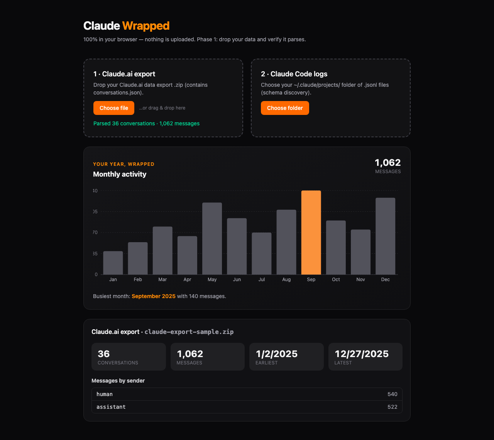

# Claude Wrapped

Turn your Claude export into a personal year-in-review — fully in your browser, no upload.

Claude Wrapped is a static, client-side web app: you drop your Claude data
export and it produces a Spotify-Wrapped-style summary of how you used Claude.
Nothing is uploaded — every byte is parsed locally in your browser.



## How it works

1. Export your data from Claude.ai (Settings → export) — you get a `.zip` that
   contains `conversations.json`.
2. Drop that `.zip` onto the page. The app unzips it **in-browser** with
   [JSZip](https://stuk.github.io/jszip/), locates `conversations.json`, and
   tallies your conversations, messages, senders, and time span.
3. A "wrapped" card renders your monthly activity from those parsed messages.

There is also a second drop zone for Claude Code `.jsonl` logs
(`~/.claude/projects/`). That path is currently a **schema-discovery** tool: it
samples the files and reports the keys and event types it finds, so a typed
parser can be built once the schema is confirmed.

## Status

This is an in-progress project, shipped honestly:

- **Parsing:** working — Claude.ai export `.zip` parses to counts (conversations,
  messages, messages-by-sender, earliest/latest).
- **Visualizations:** in progress — counts + one wrapped card (monthly activity,
  Recharts) live. More wrapped cards are planned.
- **Claude Code logs:** schema discovery only — sampled keys/types are reported;
  a typed parser + aggregations are not built yet.

## Privacy

100% client-side. No backend, no network calls, nothing leaves your device.
`.gitignore` blocks `*.zip` and `sample-data/` so personal exports can't be
committed by accident.

## Stack

- [Vite 6](https://vite.dev/) + [React 19](https://react.dev/) + TypeScript (strict)
- [Tailwind CSS v4](https://tailwindcss.com/) via `@tailwindcss/vite`
- [JSZip](https://stuk.github.io/jszip/) — in-browser unzip of the export
- [Recharts](https://recharts.org/) — the wrapped visualizations
- [Vitest](https://vitest.dev/) — unit tests for the data transforms

## Run locally

```bash
npm install
npm run dev        # local dev server
npm run build      # typecheck + production build
npm test           # run unit tests
```

Then open the printed local URL and drop your export `.zip`.

## License

[MIT](./LICENSE) © 2025 CodingFreeze
